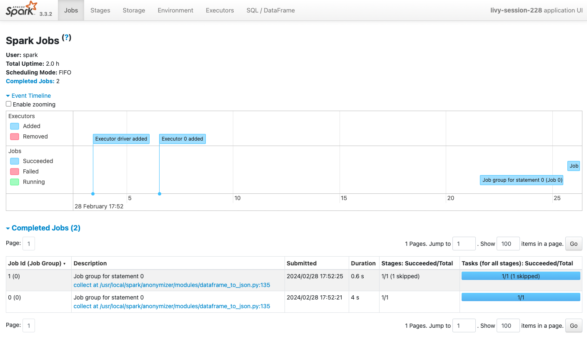
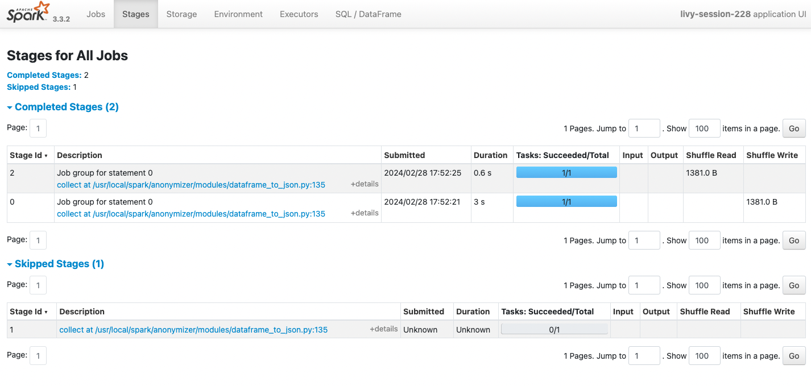

# Spark 애플리케이션 실행 단계
스파크 코드를 최적화하려면 애플리케이션이 어떻게 실행되고 어느 부분에서 병목이 일어나는지 잘 파악하는 것이 중요하다. 
스파크 애플리케이션은 데이터 로드, 처리, 분석 및 저장 등 다양한 작업을 효율적으로 관리하기 위해 실행 단계를 여러 개로 나눈다. 
이 실행 단계는 Job, Stage, Task로 나뉘게 되는데 이 구조는 스파크가 데이터를 병렬로 빠르게 처리하는데 중요한 역할을 한다. 
이 실행 단계를 알아두면 데이터 셔플링, Task 실행 시간, Stage 처리 시간 등 성능에 영향을 미치는 요소를 디버깅 하기 수월해진다. 
오늘은 이 스파크 애플리케이션의 실행 단계 `Job 생성 - Stage 분할 - Task 할당 - 실행 및 결과 반환` 이라는 일련의 과정을 자세히 알아보려고 한다. 

## Job 스케줄링

스파크 애플리케이션의 드라이버와 실행자(executor)가 시작된 후에 스파크 스케줄러는 어떤 실행자가 어떤 Task를 수행할지 결정하게 되는데 이걸 Job 스케줄링이라고 한다. 
스파크는 Job을 처리하기 위해 내부적으로 DAG(Directed Acyclic Graph) 스케줄러를 사용한다. 
DAG 스케줄러는 RDD의 액션, 트랜스포메이션 연산들을 분석해 Job을 구성하는 Stage들로 나누고 이 Stage들 사이의 의존성을 바탕으로 실행 순서를 결정한다. 

## Job 생성
Job은 스파크 애플리케이션에서 실행되는 개별 작업 단위이다. 
애플리케이션은 하나 이상의 Job을 생성하며 일반적으로 스파크 액션을 만날 때마다 생성된다. 
여기서 액션 연산은 (ex. `collect()`, `count()`, `save()` 등) 실제 데이터를 반환하거나 외부 시스템에 저장하는 연산을 말한다. 
Job은 다시 셔플링이 필요한 연산을 만나면, 그 지점을 기준으로 작업을 여러 스테이지로 나뉜다.

## Stage 분할

Stage는 Job을 구성하는 중간 단계로 스파크가 DAG을 분석한 결과에 기반해서 생성된다. 
Stage는 셔플 연산 (ex. `groupBy()`, `reduceByKey`) 같이 다른 노드로 데이터 재분배가 필요한 지점에서 분리된다. 
정확히는 셔플링 발생 예정 지점에서 스테이지의 분리가 계획되고 실제 셔플링 후의 연산들은 새로운 스테이지에서 처리되기 때문에 Stage가 런타임 중 증분하는 것처럼 보인다. 
Stage의 실행은 모든 입력 데이터가 준비되었을 때 시작되고 모든 Task의 실행이 완료되면 다음 Stage로 넘어간다.

## Task 할당
Task는 스파크에서 실행되는 Stage 내의 개별 연산을 담당으로 가장 작은 작업 단위이다. 
각 Task는 클러스터의 단일 노드에서 실행되며 입력 데이터의 한 파티션에 대한 연산을 수행한다. 
스파크는 데이터를 파티션으로 나누고 각 파티션에 대해 Task를 할당하여 병렬 처리를 수행한다. 
Task는 독립적으로 실행되며 실패할 경우 스파크에 의해 자동으로 재시도될 수 있다. 

# 마무리
이러한 방식으로 스파크는 데이터 처리 작업을 효율적으로 조정하고 복잡한 데이터 처리 파이프라인을 유연하게 실행할 수 있다. 
스파크 애플리케이션은 실행 단계를 구분하여 계획함으로써 클러스터의 리소스를 효율적으로 사용할 수 있게 한다. 
이렇게 스파크가 대규모 데이터셋을 다루는 방법을 차근차근 이해하다 보면 스파크 애플리케이션 코드를 작성하는데 큰 도움이 될 거 같다. 
