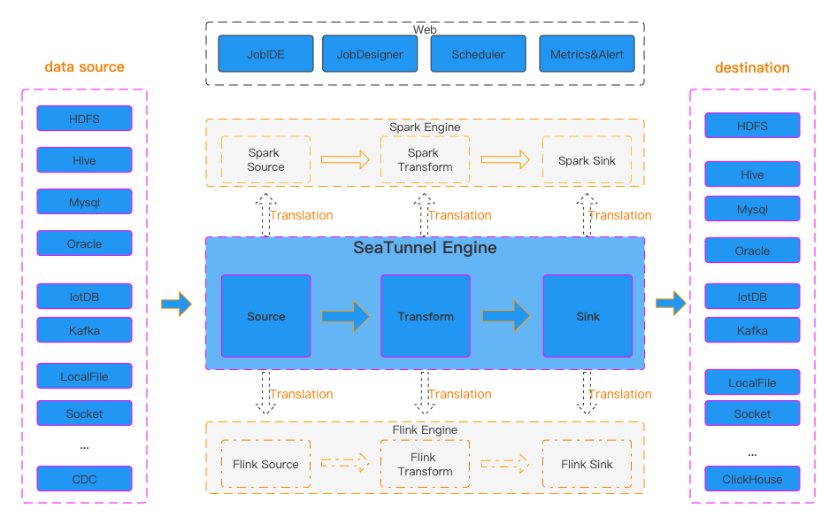
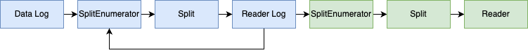

# 아파치 씨터널(Apache Seatunnel)
아파치 씨터널(Apache Seatunnel)은 데이터 통합 플랫폼 도구로 여러 데이터 소스와 싱크를 지원하는 분산형 데이터 처리 엔진이다. 
초기 버전은 워터드롭(Waterdrop)이라는 이름으로 개발되었으나 프로젝트가 발전하면서 아파치 인큐베이터 프로젝트로 채택되었고 Seatunnel이라는 이름으로 변경되었다. 
씨터널 자체 엔진 외에도 스파크 엔진을 사용할 수 있으며 현재는 플링크 엔진도 추가되어 데이터 처리 작업을 할 수 있도록 발전되었다. 
현재 씨터널은 사용자 친화적 설정 방식과 높은 확장성을 제공하는 데이터 통합 도구로 자리잡고 있다.

## 주요 기능 소개
* 실행 계획 최적화로 빠른 데이터 처리
  * 실행 계획을 최적화하여 네트워크를 통해 데이터를 전송할 때 생기는 시간을 줄여 더 빠르게 동기화할 수 있게 해준다. 
  * 데이터 직렬화와 역직렬화로 인한 전체 동기화 성능의 손실을 줄여 빠른 데이터 동기화 작업을 지원한다. 
  * 데이터 동기화가 적절한 속도로 수행될 수 있도록 속도 제한 기능도 지원한다. 
* 체크포인트와 장애 복구 기능으로 안정적인 데이터 처리
  * 작업이 실패하면 그 작업의 상하위 작업에만 영향을 미치며 전체 작업이 실패하거나 롤백되는 것을 방지한다. 
  * 소스 데이터의 저장 기능이 제한되어있을 경우를 대비해 데이터 캐시를 지원하며 캐시가 활성화되면 소스에서 읽은 데이터가 자동으로 캐시되어 하위 작업에서 읽고 대상 시스템에 작업 가능하다. 
  * 데이터를 처리하는 동안 문제가 생겨도 원본 데이터를 잃지 않도록 지원한다. 
* 동적 스레드 공유를 활용한 시스템 공간 절약
  * 실시간 동기화에서 테이블은 많지만 각 테이블의 데이터 크기가 작은 경우 동기화 작업을 공유 스레드에서 실행해 불필요한 스레드 생성을 줄이고 시스템 공간을 절약한다. 
  * 데이터 읽기 쓰기 측면에서 JDBC 연결 수를 최소화 하여 사용하는 것을 목표로 설게되었다. 
* 타서비스의 의존도를 줄인 편리한 사용성
  * 주키퍼나 HDFS와 같은 다른 빅데이터 구성 요소 없이 클러스터 관리와 스냅샷 저장, 클러스터 고가용성 기능을 구현한다. 
  * 복잡한 소프트웨어에 의존하지 않고 독립적으로 작동할 수 있도록 설계되었다. 

## 씨터널로 진행하는 CDC 소개
CDC(Change Data Capture)는 데이터베이스 이벤트(삽입, 업데이트, 삭제)의 변경 사항을 추적하고 이벤트 발생 순서대로 타 시스템에 반영할 때 사용되는 기술이다. 
CDC는 주로 원본 시스템과 백업 시스템 간의 데이터 동기화를 위해 원본 시스템에서 백업 시스템으로 실시간 데이터 동기화가 가능하게 한다. 

### 씨터널 CDC 유형
씨터널 CDC의 데이터 동기화는 두 가지 유형으로 나뉜다.
* 스냅샷 읽기 : 시스템의 특정 시점의 스냅샷을 활용해 데이터를 읽어온다. 
* 증분 동기화 : 테이블에서 증분 변경 사항을 읽어온다.

#### 스냅샷 읽기

씨터널에서 스냅샷을 활용한 데이터 동기화 기능에서 주목할 부분은 "Lock-Free"를 제공한다는 점이다. 
기존에 Debezium 같은 CDC 플랫폼은 데이터를 동기화하는 동안 테이블을 락을 걸게 되는데 씨터널의 CDC는 데이터를 읽어올 때 테이블을 잠그지 않고 읽어온다. 
이렇게 되면 데이터베이스가 동시에 여러 작업을 처리할 수 있어 더 빠르고 효율적으로 데이터 동기화가 가능하다. 

* 데이터 분할
  * `SplitEnumerator` 라는 분배자가 테이블의 특정 필드(ex. ID)의 크기를 기준으로 데이터를 분할하여 작게 나누게 된다. 
  * 분할 기준이 되는 필드는 주로 테이블의 PK나 인덱스 필드와 같은 고유값을 가지는 필드를 사용한다. 
  * 분할의 크기(한 번에 읽어올 데이터의 양)을 설정 가능하다. 기본적으로 성능과 리소스 사용량을 고려하여 결정한다.

* 병렬 처리
  * 분할된 데이터들은 `Reader`라는 데이터 읽기 담당자에게 할당된다.
  * 여러 `Reader`는 동시에 작업을 진행하기 때문에 전체 작업이 빨라진다.
  * 각 `Reader`는 `SplitEnumerator로부터 자신이 읽어야할 데이터 분할 정보를 받는데 이 정보에는 어떤 데이터를 읽어야 하는지와 범위(start, end 지점)가 포함된다. 

* 데이터 읽기
  * `Reader`는 자신에게 할당된 분할 데이터를 읽기 위해 적절한 SQL문을 생성한다. 
  * 예를 들어 테이블의 특정 범위의 데이터를 select하는 SQL문을 작성한다.
  * 데이터를 읽기 전 `Reader`는 변경 사항 추적 및 검증을 위해 현재 데이터베이스 로그 (WAL 또는 트랜잭션 로그)의 시작 위치를 기록한다. 
  * 읽어온 데이터는 시스템에 저장되거나 타겟 시스템에 전송된다. 

* 이벤트 피드백
  * 각 `Reader`는 자신에게 할당된 데이터를 읽으면 다시 `SplitEnumerator`에게 리포트 한다. 
  * 이 리포트를 바탕으로 `SplitEnumerator`는 다음 데이터를 할당하고 작업을 이어나간다. 
  * 리포트에는 splitId(읽은 분할 데이터의 ID)와 highWatermark(해당 분할의 로그 위치)를 포함한다. 

예를 들어 100만건의 데이터를 10만건씩 분할한다고 하면 `SplitEnumerator`가 10개의 분할된 데이터를 `Reader`에게 나눠주고 각 `Reader`들은 자신에게 할당된 10만건의 데이터를 읽는다. 
`Reader`의 갯수는 보통 리소스 기반하여 결정되기 때문에 시스템이 4개의 CPU 코어를 가지고 있다면 동시에 4개의 `Reader`가 동작하게 된다. 
그러므로 4개의 `Reader`는 10만건의 데이터를 처리한 후 `SplitEnumerator`에게 처리 결과를 보고하게 되고 보고 받은 `SplitEnumerator`는 `Reader`에게 새로운 분할 데이터를 할당한다. 

#### 증분 동기화

증분 동기화는 스냅샷 읽기 단계 이후에 발생한 데이터베이스 변경 사항을 실시간으로 백업 데이터베이스에 동기화하는 작업이다. 
이 단계에서는 데이터베이스의 로그 (ex. MySQL의 bin log, PSQL의 WALog)를 실시간으로 모니터링하여 변경된 데이터를 추적한다. 
증분 동기화는 일반적으로 데이터베이스의 로그를 가져올 때 중복을 방지하고 데이터베이스 부담을 줄이기 위해 단일 스레드로 실행된다. 
하나의 `Reader`가 하나의 커넥션을 통해 모든 변경 사항을 처리하게 된다. 

* 초기 설정
  * 증분 동기화 단계는 스냅샷 단계에서 읽어온 모든 분할 데이터를 하나의 단위로 통합하여 관리한다. 
  * 통합된 분할 데이터는 각 분할의 시작 위치와 종료 위치(종료 위치는 없을 수도 있음)가 포함된다. 
  * 여기서 통합은 물리적으로 데이터를 합친다는 의미가 아니라 변경 사항을 추적 관리하기 위해 각 분할 데이터를 하나로 관리한다는 의미이다.

* 로그 모니터링
  * 하나의 `Reader`가 데이터베이스의 모든 로그를 실시간으로 모니터링한다. 
  * 로그에는 데이터베이스에서 발생한 모든 변경 사항이 기록된다.
  
* 변경 사항 동기화
  * 로그에 기록된 변경 사항을 읽어서 타겟 데이터베이스에 동기화한다.
  * 스냅샷 이후의 모든 변경 사항이 타겟 데이터베이스에 반영된다. 

* 이벤트 피드백
  * `Reader`는 변경 사항을 동기화한 후 `SplitEnumerator`에게 진행 상황을 리포트한다. 
  * 리포트 내용에는 현재까지 처리된 로그의 위치가 포함된다. 
